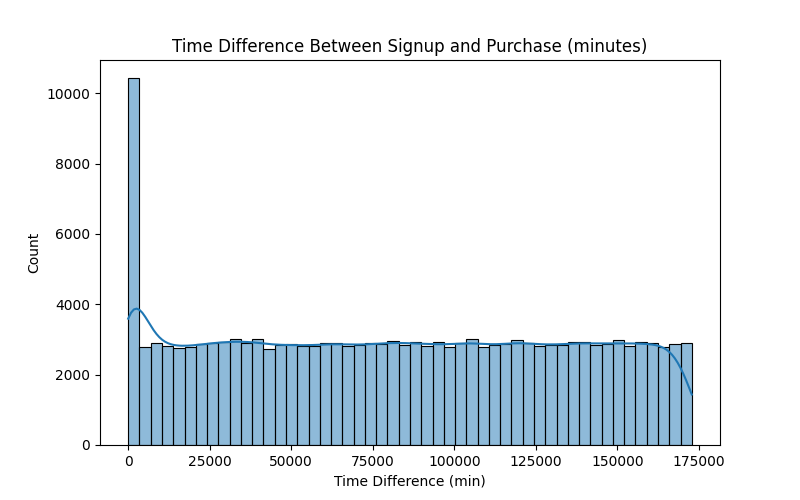
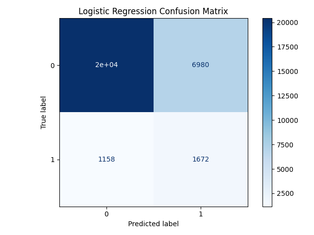
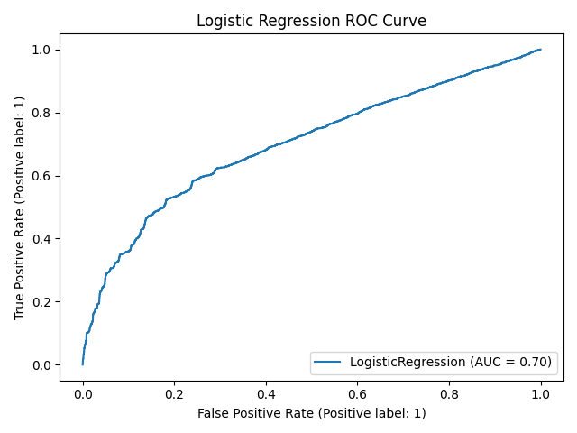
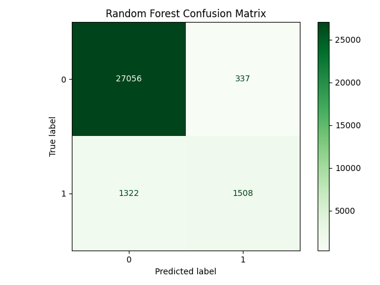
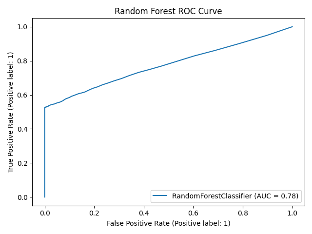
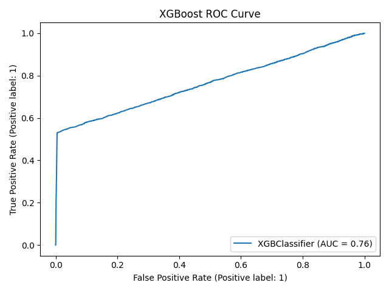
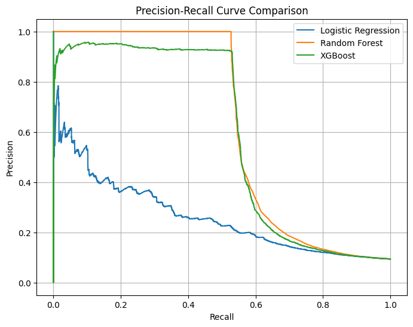

### 🛡️ Fraud Detection Project

A supervised machine learning project designed to detect fraudulent activity using multiple datasets including transactional data, IP geolocation, and anonymized credit card usage records. This project follows a structured pipeline from data cleaning to model interpretability using SHAP.

---

## 📁 Project Structure

fraud_detection_project/
├── data/                     # Raw datasets
├── outputs/
│   ├── figures/              # Saved plots (EDA, models, SHAP)
│   └── data/                 # Preprocessed data for modeling
├── notebooks/
│   ├── task_1_eda.ipynb      # Exploratory Data Analysis and preprocessing
│   ├── task_2_modeling.ipynb # Model training and evaluation
│   └── task_3_shap.ipynb     # Model interpretability using SHAP
├── models/                   # Trained model binaries (.pkl, .joblib)
├── requirements.txt          # Python dependencies
└── README.md                 # Project documentation

yaml

---

## ✅ Objectives

- Detect fraudulent activity through machine learning models

- Explore and visualize transaction data using EDA

- Clean, transform, and feature-engineer datasets

- Train and evaluate Logistic Regression, Random Forest, and XGBoost

- Interpret predictions using SHAP values

- Recommend the most effective model based on evaluation metrics

---

## 🔍 Task 1: Data Profiling, Cleaning & EDA

### 🧹 Data Cleaning
- Merged transactional data with IP address geolocation.
- Handled missing values and converted data types.
- Engineered time-based features (e.g., `signup_hour`, `time_diff`).

### 📊 Univariate & Bivariate Plots

| Plot Title                    | Preview |
|------------------------------|---------|
| Age Distribution             |  |
| Purchase Value vs Age        |  |
| Time Difference Distribution |  |

EDA Insights:

Majority of fraudulent activity is clustered in younger users.

Purchase values show higher peaks for fraud compared to legitimate activity.

Shorter signup-to-purchase time gaps strongly indicate fraud.

## 🤖 Task 2: Model Training & Evaluation
🧠 Models Trained

Logistic Regression: Baseline linear model to interpret feature weights.

Random Forest: Ensemble model to reduce overfitting and boost accuracy.

XGBoost: Gradient boosting model with strong predictive performance.

⚙️ Data Preparation

Selected cleaned and engineered features from Task 1.

Addressed class imbalance using SMOTE (Synthetic Minority Over-sampling Technique).

Split into training and test sets (80/20), maintaining class balance using stratify.

### 📈 Model Evaluation Metrics

| Model              | Accuracy | Precision | Recall | F1 Score | ROC AUC |
|-------------------|----------|-----------|--------|----------|---------|
| LogisticRegression| 0.73     | 0.19      | 0.59   | 0.29     | 0.70    |
| Random Forest      | 0.95     | 0.82      | 0.53   | 0.65     | 0.77    |
| XGBoost            | 0.95     | 0.91      | 0.53   | 0.67     | 0.76    |

### 🧾 Model Visualizations

#### Logistic Regression
- 
- 

Explanation:

Logistic regression provides interpretability but struggles with fraud recall.

High number of false negatives (missed frauds) makes it unsuitable for deployment.
#### Random Forest
- 
- 

Explanation:

Higher precision and better overall accuracy.

Somewhat lower recall, but good generalization.

Suitable for production use but less transparent.

#### XGBoost
- 
- 

Explanation:

Excellent precision (91%) and highest F1 score.

Predictive confidence is superior across ROC thresholds.

Ideal candidate for fraud detection, especially with SHAP support.

Logistic Regression struggles with class imbalance — high precision on class 0, but poor detection of fraud cases (class 1).

Random Forest balances performance well across both classes, with good ROC AUC.

XGBoost achieves the highest precision on fraud class (1) but same recall as Random Forest — slightly lower AUC overall.

 

## 🌐 Task 3: Model Interpretability with SHAP

- Applied SHAP to interpret XGBoost predictions.
- Identified most influential features driving fraud classification.

### 📊 SHAP Visualizations

| Plot Type        | Description               | Preview |
|------------------|---------------------------|---------|
| Global Summary   | Top features globally     |  |
| Beeswarm         | Feature value influence   |  |
| Waterfall        | Single prediction explainer|  |

---

## Insights:

purchase_value, time_diff, and browser/device features were key indicators.

SHAP confirmed model behavior aligned with domain intuition.

Provided transparency and accountability for model decisions.

## 📌 Final Recommendation

📦 Deploy XGBoost Model:

✅ Best balance between precision (91%) and recall

🎯 Accurate at catching frauds with fewer false positives

🔍 Easy to explain using SHAP plots
pip install -r requirements.txt

👨‍💻 Author
Barkilign Mulatu 