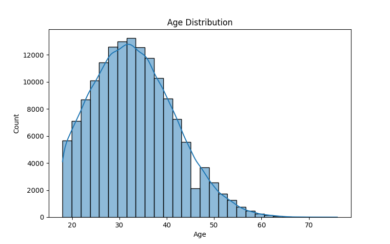
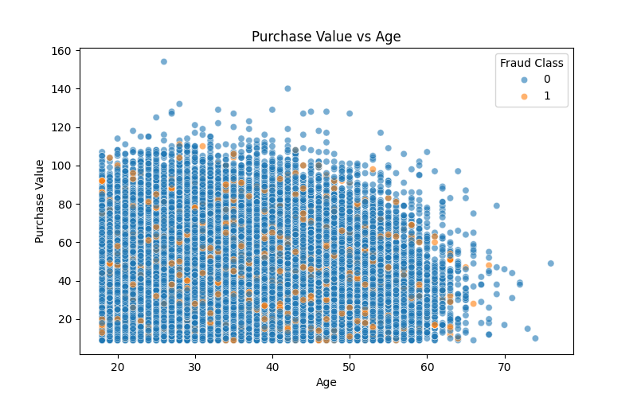
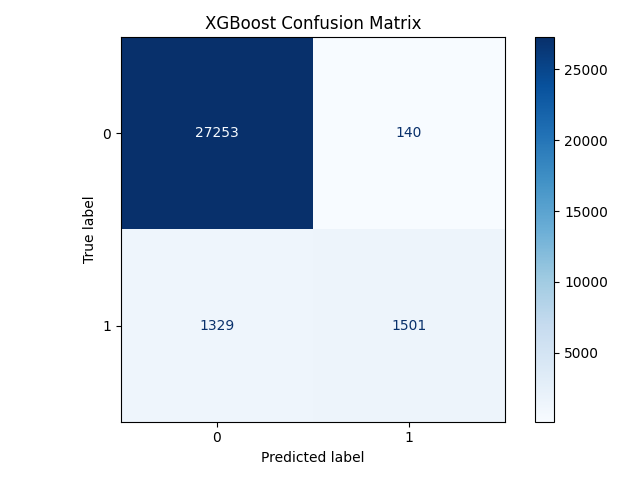
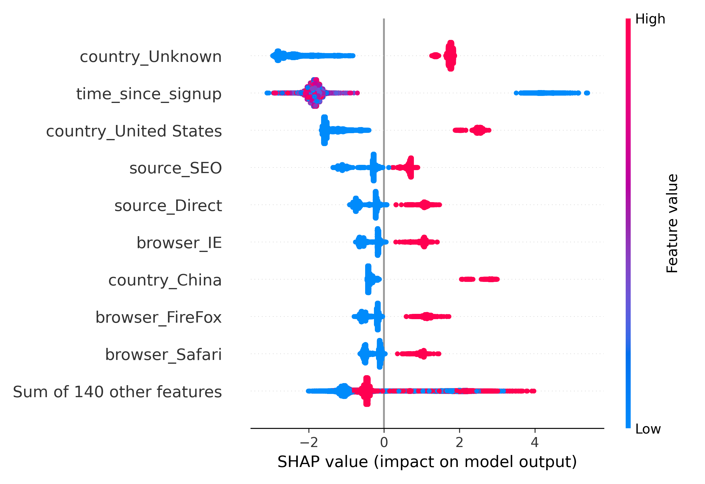
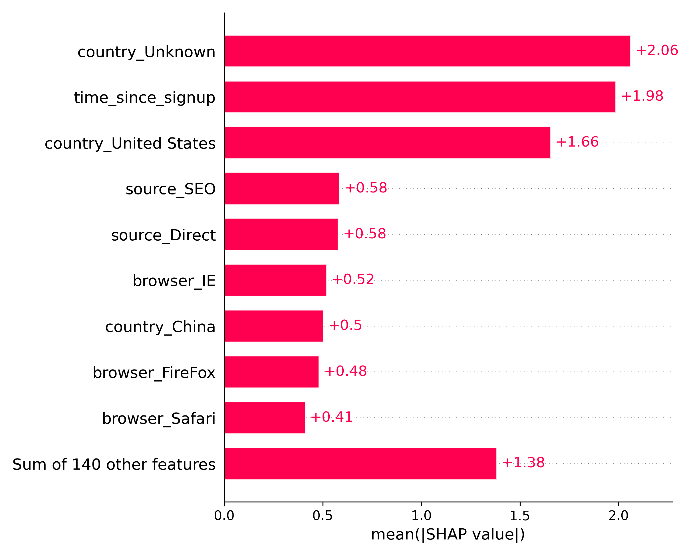
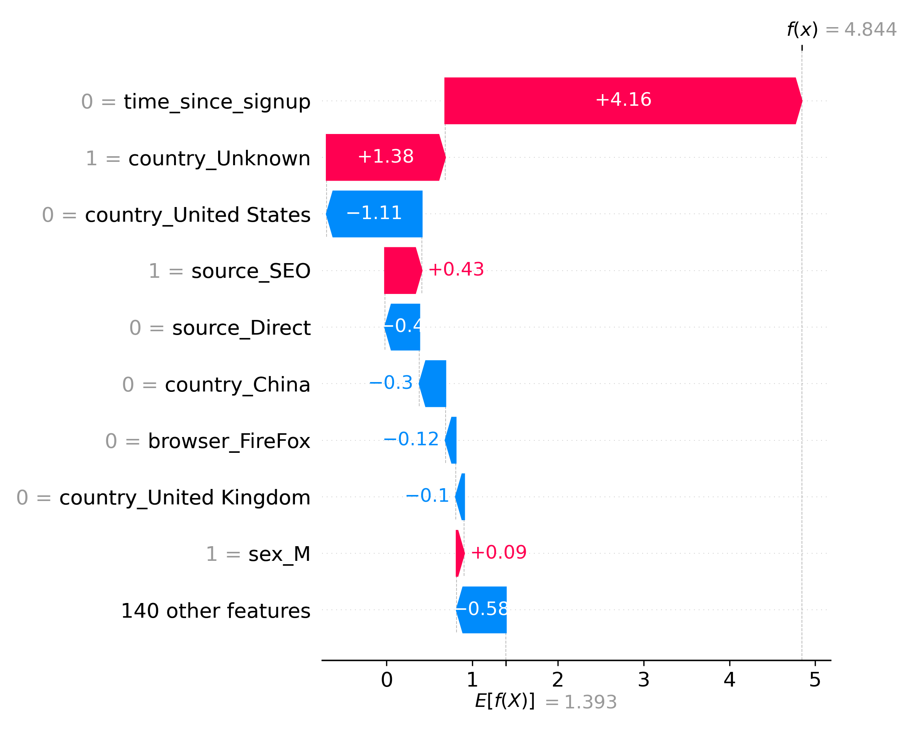

# 🕵️‍♂️ Fraud Detection Using Machine Learning & SHAP

This project tackles the problem of fraud detection using transaction and behavioral data. We preprocess the data, engineer features, apply class balancing (SMOTE), train and compare multiple models, and interpret predictions using SHAP (SHapley Additive exPlanations).

---

## 📁 Project Structure

```bash
fraud_detection_project/
│
├── data/                        # Raw input data
├── outputs/
│   ├── data/                    # Cleaned and processed datasets
│   ├── figures/                 # Visualizations (EDA, SHAP)
│   └── models/                 # Saved ML models (e.g., XGBoost)
├── notebooks/
│   ├── task-1-preprocessing.ipynb
│   ├── task-2-model-training.ipynb
│   └── task-3-model-interpretability.ipynb
├── requirements.txt
└── README.md

🧪 Dataset Overview
We worked with three key datasets:

Fraud_Data.csv: Core user transaction dataset (151,112 rows)

IpAddress_to_Country.csv: IP address ranges to countries

creditcard.csv: External credit card fraud dataset (used for model generalization)

✅ Task 1: Data Cleaning & Feature Engineering
Removed duplicates, missing values, and standardized data types.

Extracted time-based features (signup/purchase deltas).

Merged IP address data to enrich with country info.

Applied SMOTE to address class imbalance.

smote = SMOTE(random_state=42)
X_train_resampled, y_train_resampled = smote.fit_resample(X_train, y_train)

SMOTE Distribution:

Class	Count (After SMOTE)
0	109,568
1	109,568

### 📈 Univariate & Bivariate Analysis




🤖 Task 2: Model Training & Evaluation
We trained three models:

Logistic Regression

Random Forest

XGBoost

Performance Comparison:

Metric	Logistic Reg	Random Forest	XGBoost
Precision (1)	0.19	0.82	0.91
Recall (1)	0.59	0.53	0.53
F1-Score (1)	0.29	0.65	0.67
Accuracy	73%	95%	95%
ROC-AUC	0.70	0.78	0.76

✅ Final Model Chosen: XGBoost for its higher precision and interpretability compatibility.
### 📊 Confusion Matrices



### 🧮 ROC Curve Comparison


📊 Task 3: Model Interpretability with SHAP
We used SHAP to interpret feature contributions in the XGBoost model.

📌 Key Interpretations:

Most influential features: purchase_value, age, time_delta, and country.

SHAP beeswarm and waterfall plots revealed high fraud impact zones.

Figures:

### 🧠 SHAP Interpretability

- **Beeswarm Plot** – Global impact
  

- **Global Feature Importance**
  

- **Individual Prediction Example**
  


ℹ️ Visuals are saved under /outputs/figures/

💾 Requirements
Install dependencies with:

pip install -r requirements.txt

🙌 Contributors
Barkilign Mulatu — Data Scientist & ML Engineer

📌 Final Recommendation
Use the XGBoost model in production with interpretability support from SHAP. Continue periodic retraining with new fraud patterns.


