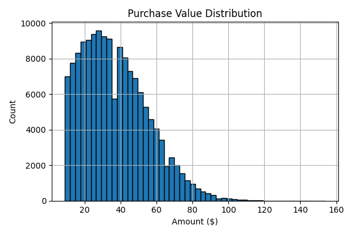

# Fraud Detection for E-commerce and Bank Transactions

## 📌 Overview

This project aims to detect fraudulent transactions in both **e-commerce** and **bank credit card** environments using machine learning. The focus during Interim 1 is on **Task 1: Data Analysis and Preprocessing**.

We work with two real-world datasets:

* **E-commerce Transactions:** Fraud detection using behavioral, temporal, and geolocation features.
* **Bank Transactions:** PCA-transformed credit card data from Kaggle.

Our preprocessing ensures that the final data is suitable for training robust and interpretable fraud detection models.

---

## 🧾 Datasets Used

| File                       | Description                                                            |
| -------------------------- | ---------------------------------------------------------------------- |
| `Fraud_Data.csv`           | E-commerce transactions including timestamps, user/device/browser info |
| `creditcard.csv`           | Credit card transactions with anonymized PCA features                  |
| `IpAddress_to_Country.csv` | Mapping of IP ranges to countries                                      |

---

## ⚙️ Task 1: Data Analysis and Preprocessing

### ✅ 1. Data Loading & Cleaning

* Checked all three datasets for null values → none found.
* Converted timestamp fields (`signup_time`, `purchase_time`) to datetime.
* Converted `ip_address` from float to integer for geolocation mapping.
* Removed duplicates.

---

### 📊 2. Exploratory Data Analysis (EDA)

* **Class Imbalance:** \~1–2% of transactions are fraudulent.
* **User Age Distribution:** Most users are between 25–40 years.
* **Purchase Value:** Right-skewed, with higher values associated with fraud.
* **Categorical Insights:** Certain browsers/sources are more fraud-prone.

#### 🖼️ Univariate Analysis Plots

* 
* 
* 
* 

#### 🖼️ Bivariate Analysis Plots

* 
* 
* 

---

### 🧠 3. Feature Engineering

Added several predictive features:

* `hour_of_day` → Purchase time (hour)
* `day_of_week` → Purchase weekday
* `time_since_signup` → Time delta in hours
* `transaction_count` → Frequency of user activity
* `country` → Extracted from IP ranges via merge with `IpAddress_to_Country.csv`

---

### 🔄 4. Data Transformation

* **Categorical Encoding:** One-hot encoded `browser`, `source`, `sex`, `country`
* **Scaling:** Standardized numerical columns like `purchase_value`, `age`, `transaction_count`
* **Train-Test Split:** Stratified split (80/20)
* **Class Imbalance Handling:** Applied **SMOTE** to training data to balance classes

```python
from imblearn.over_sampling import SMOTE

smote = SMOTE(random_state=42)
X_train_resampled, y_train_resampled = smote.fit_resample(X_train, y_train)
```

After resampling:

* Fraud and legit transactions are **perfectly balanced**: 109,568 each.
* Ready for Task 2: Model training.

---

## 📁 Folder Structure

```
fraud_detection_project/
│
├── data/
│   ├── Fraud_Data.csv
│   ├── creditcard.csv
│   └── IpAddress_to_Country.csv
│
├── notebooks/
│   └── 01_data_analysis_preprocessing.ipynb
│
├── outputs/
│   ├── figures/         # Plots and charts from EDA
│   └── models/          # (to be filled in Task 2)
│
├── requirements.txt
├── README.md
└── .gitignore
```

---

## 📌 Key Tools and Libraries

* `pandas`, `numpy`
* `matplotlib`, `seaborn`
* `scikit-learn`
* `imbalanced-learn`
* `ipaddress` (for IP-to-int conversion)

---

## 🧠 What’s Next (Task 2)

* Train two models: **Logistic Regression** and **Random Forest/XGBoost**
* Evaluate on:

  * F1-score
  * ROC-AUC
  * AUC-PR
* Select the best model for SHAP interpretation (Task 3)

---

## 🔗 Repository Checklist

* [x] README with EDA image placeholders
* [x] Clean, commented Jupyter notebook for Task 1
* [x] `.gitignore` excludes `/data`
* [x] `requirements.txt` lists key packages

---

**Maintained by:** Barkilign Mulatu ✨
